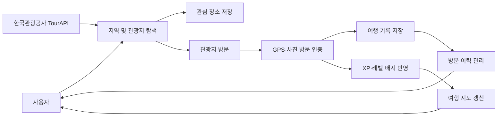
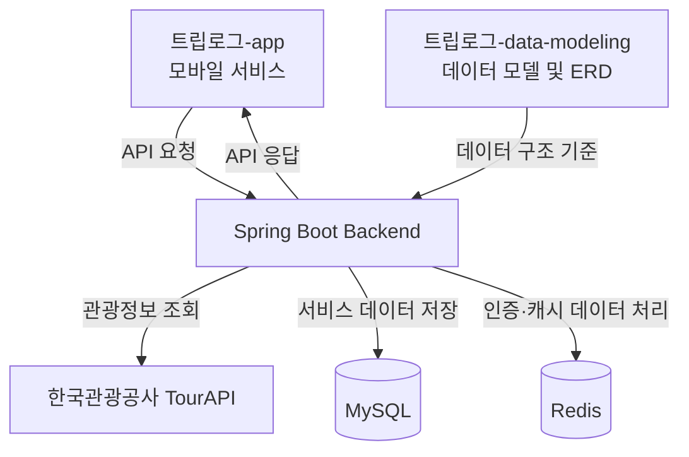

<div align="center">

# 트립로그

### 여행 기록과 방문 인증을 통해 대한민국 곳곳을 탐험하는 게이미피케이션 여행 플랫폼

관광지를 직접 방문하고 인증하며 여행 경험을 기록하고,
경험치와 배지를 쌓아 자신만의 여행 지도를 완성할 수 있도록 지원합니다.

<br/>

**2026 관광데이터 활용 공모전 프로젝트**

<br/>

<!-- 서비스 대표 이미지가 준비되면 아래 주석을 해제하세요. -->

<!--

-->

</div>

---

## 프로젝트 개요

| 구분      | 내용                                           |
| ------- | -------------------------------------------- |
| 프로젝트명   | 트립로그                                      |
| 프로젝트 형태 | 관광데이터 기반 게이미피케이션 여행 플랫폼                      |
| 참가 분야   | 2026 관광데이터 활용 공모전                            |
| 주요 사용자  | 국내 지역과 관광지를 탐색하고 여행 경험을 기록하려는 사용자            |
| 핵심 목표   | 방문 인증과 보상 시스템을 통해 새로운 지역 탐색과 지속적인 국내여행 참여 유도 |
| 활용 데이터  | 한국관광공사 TourAPI 관광정보 및 사용자 방문·활동 데이터          |

---

## 프로젝트 배경

현재 국내 관광 서비스는 관광지 검색, 여행 코스 추천, 숙박 및 음식점 정보 제공과 같이 여행 전 정보 탐색 기능에 집중된 경우가 많습니다.

사용자가 실제로 어떤 장소를 방문했는지, 어떤 지역에서 만족하거나 불편함을 느꼈는지, 여행 이후 어떤 경험을 남겼는지는 서비스 안에 지속적으로 축적되지 못합니다. 이로 인해 사용자의 재방문과 지속적인 여행 참여를 유도하기 어렵다는 한계가 있습니다.

또한 관광 수요가 이미 잘 알려진 일부 지역과 명소에 집중되면서, 인지도가 낮거나 접근성이 떨어지는 지역은 충분한 관광 자원을 보유하고 있어도 새로운 방문자를 확보하기 어렵습니다.

트립로그는 이러한 문제를 해결하기 위해 한국관광공사의 관광데이터와 사용자의 실제 방문 데이터를 연결하고, 지역 탐색부터 방문 인증, 기록과 보상까지 하나의 흐름으로 관리하는 게이미피케이션 기반 여행 플랫폼을 개발하고 있습니다.

---

## 트립로그가 해결하려는 문제

### 정보 탐색에 머무르는 여행 서비스

관광지 정보와 추천 코스를 확인하더라도 실제 방문과 여행 이후의 기록까지 하나의 서비스에서 이어지지 않는 경우가 많습니다.

트립로그는 관광지 탐색, 방문 인증, 여행 기록과 보상을 연결하여 여행 전·중·후의 경험을 하나의 흐름으로 구성합니다.

### 유명 관광지에 집중되는 관광 수요

사용자는 익숙하고 잘 알려진 지역을 반복적으로 선택하기 쉬우며, 상대적으로 인지도가 낮은 지역은 방문 계기를 만들기 어렵습니다.

트립로그는 지역별 탐험 현황, 미션과 배지 등의 성취 요소를 통해 사용자가 새로운 지역과 관광지를 발견할 동기를 제공합니다.

### 분산되어 관리되는 여행 기록

여행 사진, 방문 장소와 후기가 서로 다른 서비스에 분산되면 자신의 여행 경험을 체계적으로 관리하기 어렵습니다.

트립로그는 방문 장소, 인증 사진, 만족도와 획득한 보상을 하나의 여행 기록으로 연결합니다.

### 실제 방문 기반 데이터 부족

검색과 조회 기록만으로는 사용자가 관광지를 실제로 방문했는지 판단하기 어렵습니다.

트립로그는 GPS와 현장 사진을 활용한 방문 인증을 통해 실제 여행 활동을 기반으로 데이터를 축적합니다.

---

## 서비스 이용 흐름



트립로그의 각 저장소는 위 흐름에서 서비스 구현과 데이터 설계 영역을 담당하며, 공통된 지역·관광지·방문 데이터를 중심으로 연결됩니다.

---

## 서비스 구성

### 모바일 애플리케이션

사용자가 지역과 관광지를 탐색하고 방문을 인증하며 자신의 여행 기록과 성장 상태를 확인할 수 있는 환경을 제공합니다.

지도 탐색, 방문 인증, 찜, 여행 기록, 경험치, 배지와 마이페이지 등 사용자 중심의 기능을 담당합니다.

### 데이터 플랫폼

사용자와 관광지 정보를 관리하고 방문 인증, 경험치 지급, 레벨 계산, 배지 조건 판정과 지역 탐험 상태 갱신 등의 공통 비즈니스 정책을 처리합니다.

애플리케이션이 동일한 기준으로 데이터를 사용할 수 있도록 API와 데이터 관계를 관리합니다.

### 관광데이터 연동

한국관광공사 TourAPI를 활용하여 관광지, 문화시설, 축제, 음식점, 숙박과 레포츠 등 지역 기반 관광정보를 제공합니다.

관광지의 위치, 이미지, 주소와 상세정보를 서비스 데이터와 연결하여 지도 탐색과 방문 인증에 활용합니다.

### 데이터 모델

사용자, 지역, 관광지, 방문 인증, 여행 기록, 경험치, 배지와 미션 사이의 관계를 정의합니다.

서비스 정책이 실제 데이터베이스 구조에 일관되게 반영될 수 있도록 개념·논리·물리 모델링 산출물을 관리합니다.

---

## Repository Guide

트립로그는 서비스 구현과 데이터 모델링 산출물을 분리하기 위해 여러 저장소로 운영됩니다.

| 저장소                                                                         | 담당 영역         | 설명                                               |
| --------------------------------------------------------------------------- | ------------- | ------------------------------------------------ |
| [Triplog-app](https://github.com/Triplog11/triplog-app)                     | Application   | 트립로그 애플리케이션과 백엔드 서버, 기획 문서 및 공통 협업 규칙을 관리합니다. |
| [Triplog-data-modeling](https://github.com/Triplog11/triplog-data-modeling) | Data Modeling | 서비스의 개념·논리·물리 데이터 모델과 ERD 설계 산출물을 관리합니다.         |

각 저장소의 구체적인 구현 기능, 기술 스택, 내부 구조와 개발 규칙은 해당 저장소의 README에서 확인할 수 있습니다.

---

## 시스템 책임 분리



애플리케이션과 데이터 모델링 저장소는 독립적으로 관리되지만 서비스 정책과 데이터 관계를 기준으로 연결됩니다.

---

## 주요 사용자

### 새로운 국내 여행지를 탐색하려는 사용자

이미 알려진 관광지뿐 아니라 방문하지 않은 지역과 새로운 장소를 발견하고 싶은 사용자입니다.

### 여행 경험을 기록하고 싶은 사용자

방문한 장소, 인증 사진과 여행 활동을 하나의 서비스에서 체계적으로 관리하려는 사용자입니다.

### 성취형 콘텐츠를 선호하는 사용자

단순한 여행 정보 조회보다 경험치, 레벨, 배지와 미션을 통해 성취감을 얻고 싶은 사용자입니다.

### 지역 관광 활성화를 추진하는 기관

실제 관광객의 방문 흐름과 관광지별 활동 데이터를 바탕으로 지역 관광 콘텐츠를 개선하려는 지자체와 관광 기관입니다.

---

## 프로젝트 차별점

### 공공 관광데이터와 실제 방문 데이터의 결합

한국관광공사 TourAPI가 제공하는 관광지 기본정보에 사용자의 실제 방문 인증 데이터를 연결합니다.

단순 조회 수가 아니라 어떤 장소가 실제 방문으로 이어졌는지 확인할 수 있는 구조를 지향합니다.

### 탐색부터 기록까지 연결되는 여행 경험

관광지 검색에서 끝나지 않고 찜, 방문, 인증, 보상과 기록으로 이어지는 지속적인 사용자 흐름을 제공합니다.

```text
탐색
→ 찜
→ 방문
→ 인증
→ 기록
→ 보상
→ 여행 지도 갱신
```

### 여행 기록과 게이미피케이션의 결합

방문 인증에 따라 경험치, 레벨과 배지를 제공하여 사용자가 자신의 여행 경험을 하나의 성장 과정으로 확인할 수 있도록 합니다.

### 새로운 지역 방문 동기 제공

지역별 탐험 현황과 성취 요소를 제공하여 사용자가 방문하지 않은 지역과 인지도가 낮은 관광지를 탐색하도록 유도합니다.

### 사용자 가치와 공공 활용 가치의 결합

사용자에게는 여행의 재미와 성취감을 제공하고, 지역과 관광 기관에는 실제 방문 기반의 관광 활동 데이터를 제공합니다.

---

## 핵심 기능

### 지역 및 관광지 탐색

한국관광공사 TourAPI를 기반으로 지역별 관광지, 문화시설, 축제와 관광 콘텐츠를 제공합니다.

사용자는 지도와 검색을 통해 방문할 지역과 장소를 확인할 수 있습니다.

### GPS 및 사진 기반 방문 인증

사용자의 현재 위치와 관광지 좌표를 비교하여 방문 여부를 확인합니다.

GPS 인증이 어려운 경우 현장에서 촬영한 사진을 활용하여 보완 인증을 진행할 수 있습니다.

### 여행 기록 관리

방문 인증이 완료되면 관광지, 방문 날짜, 인증 사진과 만족도 등의 정보가 여행 기록으로 저장됩니다.

사용자는 자신의 방문 내역과 여행 활동을 다시 확인할 수 있습니다.

### XP와 레벨

방문 인증, 새로운 지역 방문과 미션 완료 등의 활동에 따라 XP를 획득합니다.

누적된 XP를 기준으로 레벨이 상승하며 사용자의 장기적인 활동량과 성장 상태를 보여줍니다.

### 배지

방문 관광지 수, 방문 지역 수와 미션 달성 여부 등 정량적인 조건을 충족하면 배지를 획득할 수 있습니다.

### 여행 지도

사용자의 방문 인증 결과에 따라 지역별 방문 상태와 탐험 진행률을 대한민국 지도에 표시합니다.

사용자는 자신이 방문한 지역과 앞으로 탐험할 지역을 한눈에 확인할 수 있습니다.

### 미션

새로운 지역 방문, 관광지 인증 등 주간 단위의 여행 미션을 제공하여 지속적인 서비스 참여를 유도합니다.

### 찜

사용자는 관심 있는 지역, 관광지와 이벤트를 저장하고 향후 방문할 장소를 관리할 수 있습니다.

---

## 관광데이터 활용

### 관광지 기본정보

관광지, 문화시설, 음식점, 숙박, 축제와 레포츠 등의 기본정보를 지역별 탐색 콘텐츠로 활용합니다.

### 위치 기반 관광정보

관광지의 위도와 경도 정보를 활용하여 지도에 관광지를 표시하고 방문 인증 가능 범위를 설정합니다.

### 관광 이미지 및 상세정보

관광지 대표 이미지, 주소, 소개, 운영 정보와 문의 정보를 관광지 상세 화면에 제공합니다.

### 지역 및 카테고리 분류

지역 코드와 관광지 유형 코드를 활용하여 관광 콘텐츠를 시·도, 시·군·구와 관광 유형별로 분류합니다.

### 사용자 방문 데이터

TourAPI의 공공 관광정보에 사용자 방문 인증 데이터를 결합하여 다음과 같은 정보를 축적할 수 있습니다.

* 관광지별 실제 방문 횟수
* 지역별 방문 흐름
* 신규 지역 탐색 현황
* 관광지별 만족도
* 관광 유형별 선호도
* 미션 참여 현황

---

## 팀원 소개

<table align="center">
  <tr>
    <td align="center" width="180">
      <a href="https://github.com/WhiteBin-bin">
        
        <br/>
        <b>백현빈</b>
      </a>
      <br/>
      Backend
    </td>
    <td align="center" width="180">
      <a href="https://github.com/saranghein">
        
        <br/>
        <b>이해인</b>
      </a>
      <br/>
      Backend
    </td>
    <td align="center" width="180">
      <a href="https://github.com/kimjusnu">
        
        <br/>
        <b>김준수</b>
      </a>
      <br/>
      Frontend · App
    </td>
    <td align="center" width="180">
      <a href="https://github.com/seonghoon1201">
        
        <br/>
        <b>정성훈</b>
      </a>
      <br/>
      Product Manager
    </td>
    <td align="center" width="180">
      <a href="https://github.com/eunsuh-park">
        
        <br/>
        <b>박은서</b>
      </a>
      <br/>
      UX · UI Designer
    </td>
  </tr>
</table>

<br/>

| 이름                                      | 담당 역할              |
| --------------------------------------- | ------------------ |
| [백현빈](https://github.com/WhiteBin-bin)  | 백엔드 개발             |
| [이해인](https://github.com/saranghein)    | 백엔드 개발             |
| [김준수](https://github.com/kimjusnu)      | 프론트엔드 애플리케이션 개발    |
| [정성훈](https://github.com/seonghoon1201) | PM 및 프로젝트 기획·일정 관리 |
| [박은서](https://github.com/eunsuh-park)   | UX/UI 설계 및 서비스 디자인 |

---

## 협업 방식

### 명세 기반 개발

기획, 디자인, 프론트엔드와 백엔드가 동일한 기준으로 기능을 구현할 수 있도록 메뉴 트리, 기능 명세와 서비스 정책을 기준으로 개발합니다.

### 이슈 단위 작업 관리

기능을 작업 가능한 단위로 분리하고 GitHub Issue를 통해 작업 목적, 담당자와 진행 상태를 관리합니다.

### Pull Request 기반 검토

모든 변경 사항은 Pull Request를 통해 공유하며 구현 내용과 영향 범위를 확인한 후 통합합니다.

### 데이터 모델 기반 개발

서비스 정책과 기능 명세를 기준으로 데이터 관계를 먼저 정의하고, 개념·논리·물리 모델링을 거쳐 실제 데이터베이스 구조에 반영합니다.

### 산출물 중앙 관리

기능 명세, 서비스 정책, WBS, 데이터 스키마, ERD와 GitHub 협업 규칙을 문서로 관리하여 팀 간 정보 불일치를 줄입니다.

### 보안 정보 관리

API Key, 인증키와 실제 환경변수 파일은 저장소에 업로드하지 않습니다.

환경변수 예시 파일에는 필요한 키 이름만 작성하고 실제 값은 별도로 관리합니다.

---

## 프로젝트 발전 방향

### MVP 구축

지역과 관광지 탐색, GPS 및 사진 방문 인증, 여행 기록, XP, 레벨, 배지와 여행 지도 기능을 중심으로 핵심 사용자 흐름을 구현합니다.

### 게이미피케이션 고도화

랭킹, 랭크, 랜드마크 카드, 칭호와 시즌 미션을 추가하여 사용자의 장기적인 참여와 경쟁 요소를 강화합니다.

### 개인화 추천

사용자의 방문 이력, 관심 지역과 선호 관광 유형을 기반으로 새로운 지역과 여행 코스를 추천합니다.

### 지역 및 상권 연계

지역 축제, 전통시장과 로컬 브랜드를 미션 및 보상과 연결하여 실제 관광과 지역 소비로 이어지는 구조를 구축합니다.

### 관광 데이터 플랫폼 확장

누적된 방문 인증과 만족도 데이터를 기반으로 지역별 관광 흐름과 개선 요소를 분석할 수 있는 데이터 플랫폼으로 확장합니다.

---

## 문서 안내

프로젝트의 구현 및 설계 세부 내용은 각 저장소에서 확인할 수 있습니다.

* 서비스 구현과 개발 문서: [트립로그_app](https://github.com/트립로그11/트립로그_app)
* 개념·논리·물리 데이터 모델링: [트립로그-data-modeling](https://github.com/트립로그11/트립로그-data-modeling)
